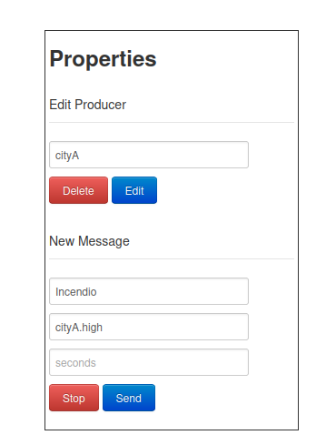
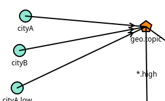
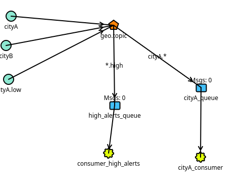

# 📡 Informe: Ejercicio 6 – Alertas Geolocalizadas con Exchange `geo.topic`

## 🛠️ 1. Configuración del Exchange

- **Nombre del Exchange**: `geo.topic`
- **Tipo de Exchange**: `topic`
- **Objetivo**: Enrutar alertas geolocalizadas según ciudad y severidad usando routing keys.

---

## 📥 2. Colas y Bindings

Se crearon dos colas con los siguientes patrones de enrutamiento:

| Cola               | Binding Key |
|--------------------|-------------|
| `cityA_queue`      | `cityA.*`   |
| `high_alerts_queue`| `*.high`    |

Esto permite enrutar:
- Todas las alertas de `cityA` a `cityA_queue`.
- Todas las alertas con severidad `high` a `high_alerts_queue`.

---

## 📤 3. Mensajes Enviados (Producer)

Se utilizaron varias producers los cuales enviaban mensajes de prueba
en el simulador podiamos escoger un payload el cual era un mensaje que se imprimia por los consumers, un una routing key el cual era usado por el exchange para los bingings y seconds el cual era le frecuencia de envio del mensaje


---

## 📬 4. Distribución de Mensajes (Resultado Observado)

| Routing Key   | Recibido en `cityA_queue` | Recibido en `high_alerts_queue` |
|---------------|---------------------------|----------------------------------|
| `cityA.high`  | ✅                         | ✅                                |
| `cityA.low`   | ✅                         | ❌                                |
| `cityB.high`  | ❌                         | ✅                                |

> La entrega múltiple del mensaje `cityA.high` demuestra el correcto funcionamiento del exchange tipo `topic`.

---

## 📸 5. Captura de Pantalla


--

## 🧠 6. Conclusiones

- El uso del exchange tipo `topic` permite enrutar mensajes según múltiples criterios (ubicación y severidad).
- El patrón `cityA.*` recibe todos los eventos de la ciudad sin importar la gravedad.
- El patrón `*.high` captura eventos críticos sin importar la ciudad.
- Un solo producer es suficiente para enviar múltiples alertas variando solo routing key y payload.

---

## 📁 7. Estructura del Repositorio

```bash
ejercicio6-alertas/
├── informe.md
├── capturas/
│   ├── exchange_config.png
│   ├── bindings_config.png
│   ├── producer_sent_messages.png
│   ├── cityA_queue_received.png
│   └── high_alerts_queue_received.png
